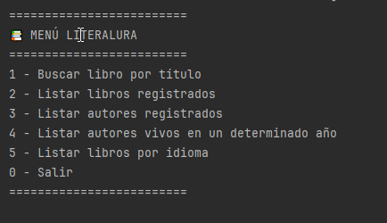
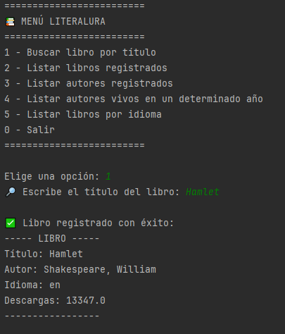
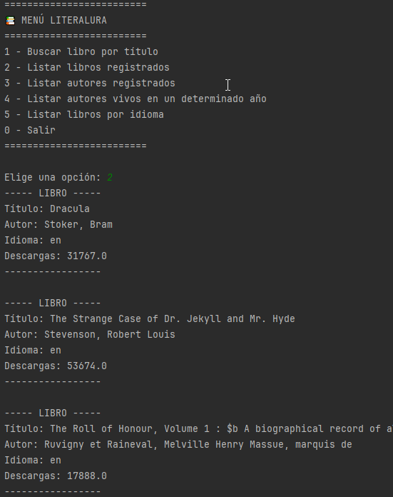
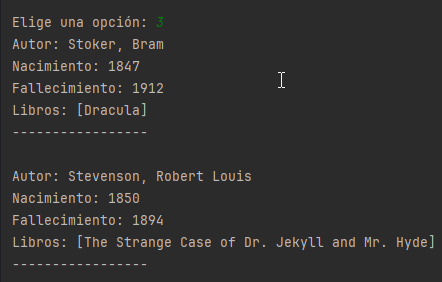
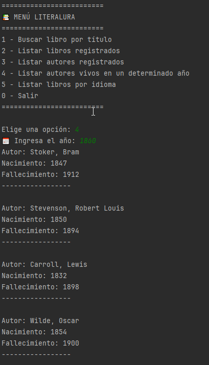
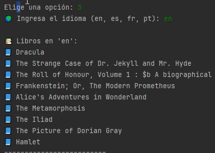

# 📚 LiterAlura

Proyecto desarrollado como parte del **challenge LiterAlura – Alura LATAM**, cuyo objetivo es construir una aplicación Java que consuma una API externa de libros, almacene la información en una base de datos local y permita distintas consultas desde consola.


---

## 🎯 Objetivo del proyecto

* Consumir datos de libros desde una API externa.
* Persistir libros y autores en una base de datos local.
* Evitar duplicados en la base de datos.
* Permitir consultas desde un menú en consola.
* Manejar correctamente errores y validaciones.

---

## 🛠️ Tecnologías utilizadas

Las tecnologías usadas corresponden a las solicitadas en la guía oficial de Alura:

* **Java 17**
* **Spring Boot**
* **Spring Data JPA**
* **Hibernate**
* **PostgreSQL** (Base de datos relacional)
* **API REST externa (Gutendex)**
* **Maven**
* **Git & GitHub**

---

## 📂 Estructura del proyecto

```text
src
└── main
    ├── java
    │   └── com.alura.LiterAlura
    │       ├── dto
    │       │   ├── AutorDTO
    │       │   ├── LibroDTO
    │       │   └── ResultadoDTO
    │       │
    │       ├── model
    │       │   ├── Autor
    │       │   └── Libro
    │       │
    │       ├── repository
    │       │   ├── AutorRepository
    │       │   └── LibroRepository
    │       │
    │       ├── service
    │       │   ├── AutorService
    │       │   ├── ConsumoAPI
    │       │   ├── ConvierteDatos
    │       │   └── LibroService
    │       │
    │       ├── LiterAluraApplication
    │       └── Principal
    │
    └── resources

```

---

## ⚙️ Funcionalidades implementadas

*(A continuación se muestran capturas del menú principal y de cada opción implementada)*

### 📸 Menú principal



* 🔍 Buscar libros por título desde la API.

### 📸 Opción 1 – Buscar libro por título



* 💾 Guardar libros y autores en la base de datos local.

### 📸 Opción 2 – Listar libros registrados



* 📋 Listar todos los libros registrados.

### 📸 Opción 3 – Listar autores registrados



* ✍️ Consultar autores registrados.

### 📸 Opción 4 – Listar autores vivos en un determinado año.



### 📸 Opción 5 –  Listar libros por idioma



* 🌍 Listar libros por idioma.
---

## 🧠 Validaciones y mensajes de control

**Durante el desarrollo se implementaron validaciones claras para mejorar la experiencia del usuario y evitar errores comunes:**


* Gestión de Duplicados: Antes de cada registro, el sistema verifica:**

⚠️ El libro ya está registrado en la base de datos local.

* **Validación de API: Manejo de respuestas vacías o datos incompletos:**

❌ No se encontraron libros con ese título en la API.

❌ El libro encontrado no tiene autor registrado.

* **Validación de Entradas: Control de tipos de datos en consola:**

❌ Año inválido. (Manejo de NumberFormatException).

❌ No hay libros en ese idioma.

* **Estas validaciones evitan duplicados, datos inconsistentes y consultas sin resultados.**

---

## ▶️ Cómo ejecutar el proyecto
**1. Clona el repositorio:**
```
git clone <URL-del-repositorio>
```
**2. Configuración de la Base de Datos: Asegúrate de tener instalado PostgreSQL y configurar tus credenciales en el archivo src/main/resources/application.properties:**
```
Properties
spring.datasource.url=jdbc:postgresql://localhost:5432/literalura
spring.datasource.username=TU_USUARIO
spring.datasource.password=TU_CONTRASEÑA
Nota: Debes crear la base de datos llamada literalura manualmente antes de iniciar.
```

**3. Abre el proyecto en tu IDE favorito (Recomendado: IntelliJ IDEA).**

**4. Ejecuta la aplicación: Inicia la clase LiterAluraApplication y usa el menú en consola.**
---

## 📌 Notas finales

Este proyecto fue desarrollado cuidando:

* Claridad en el código.
* Separación de responsabilidades (modelo, repositorio, servicio).
* Manejo correcto de errores.
* Cumplimiento de los requisitos del challenge LiterAlura.

---

✨ Proyecto realizado como parte de la formación **Java Backend – Alura LATAM**.
